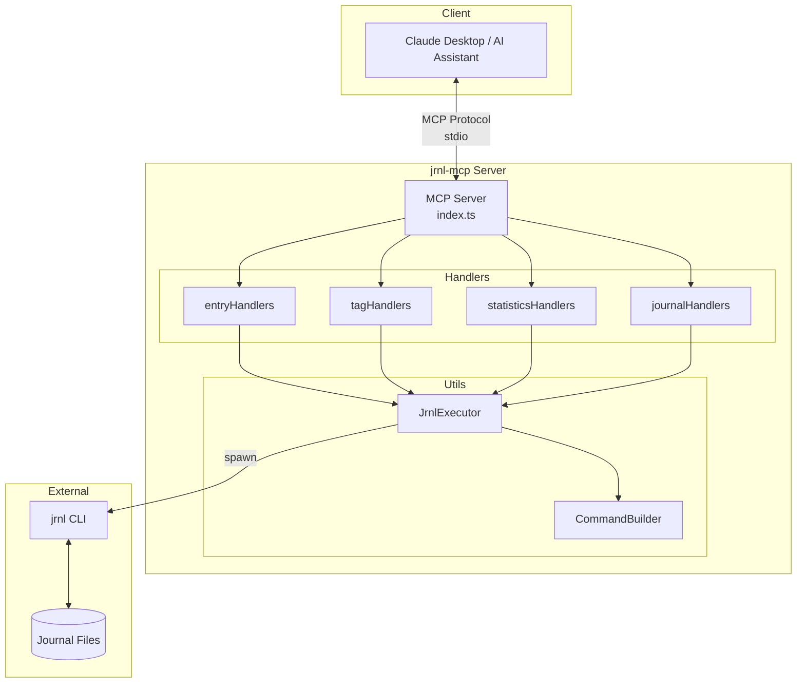
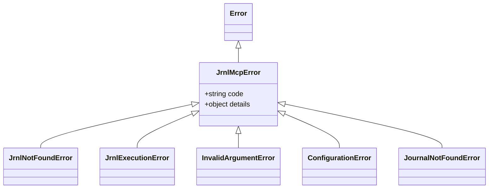
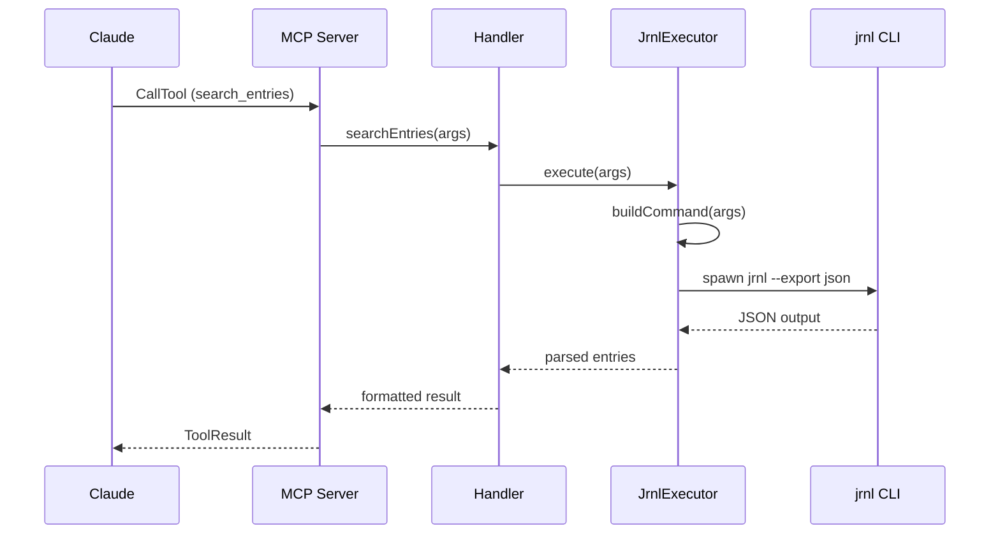

# Architecture

This document describes the architecture of jrnl-mcp.

## Overview

jrnl-mcp is a read-only MCP (Model Context Protocol) server that acts as a bridge between AI assistants (like Claude) and the jrnl CLI tool.



## Components

### Entry Point (`src/index.ts`)

- Initializes MCP Server with stdio transport
- Registers 6 tools: `search_entries`, `list_tags`, `analyze_tag_cooccurrence`, `get_statistics`, `list_journals`, `set_journal`
- Routes tool calls to appropriate handlers

### Handlers (`src/handlers/`)

| File | Tools | Description |
|------|-------|-------------|
| `entryHandlers.ts` | `search_entries` | Search and filter journal entries |
| `tagHandlers.ts` | `list_tags`, `analyze_tag_cooccurrence` | Tag listing and co-occurrence analysis |
| `statisticsHandlers.ts` | `get_statistics` | Entry counts, word stats, temporal grouping |
| `journalHandlers.ts` | `list_journals`, `set_journal` | Multi-journal management |

### Utilities (`src/utils/`)

| File | Purpose |
|------|---------|
| `jrnlExecutor.ts` | Spawns jrnl CLI process, parses JSON output |
| `commandBuilder.ts` | Builds jrnl command arguments safely |
| `dateUtils.ts` | Date formatting utilities |
| `logger.ts` | Logging utilities (stderr, debug mode) |

### Error Handling (`src/errors/`)

Custom error classes for better error reporting:



## Data Flow



## Security

- **Read-only**: No write operations to journals
- **Input validation**: CommandBuilder sanitizes all arguments
- **No shell execution**: Uses `spawn` with argument array (no shell injection)
- **Stderr isolation**: All logs go to stderr, stdout reserved for MCP protocol

## Directory Structure

```
src/
├── index.ts              # MCP server entry point
├── handlers/
│   ├── entryHandlers.ts  # search_entries
│   ├── tagHandlers.ts    # list_tags, analyze_tag_cooccurrence
│   ├── statisticsHandlers.ts  # get_statistics
│   └── journalHandlers.ts     # list_journals, set_journal
├── utils/
│   ├── jrnlExecutor.ts   # CLI execution
│   ├── commandBuilder.ts # Command construction
│   ├── dateUtils.ts      # Date utilities
│   └── logger.ts         # Logging
├── errors/
│   └── index.ts          # Custom error classes
└── types/
    └── jrnl.ts           # TypeScript type definitions
```
